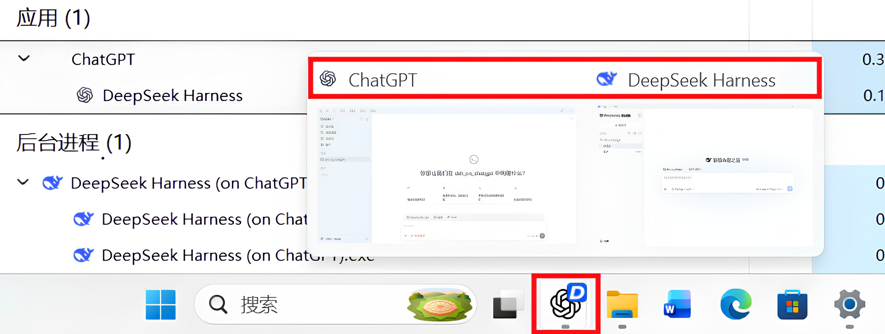
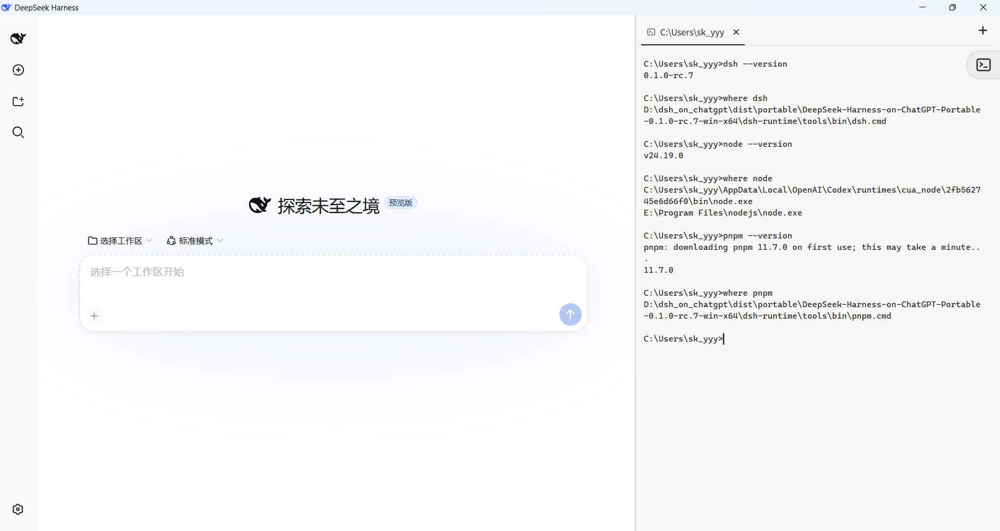
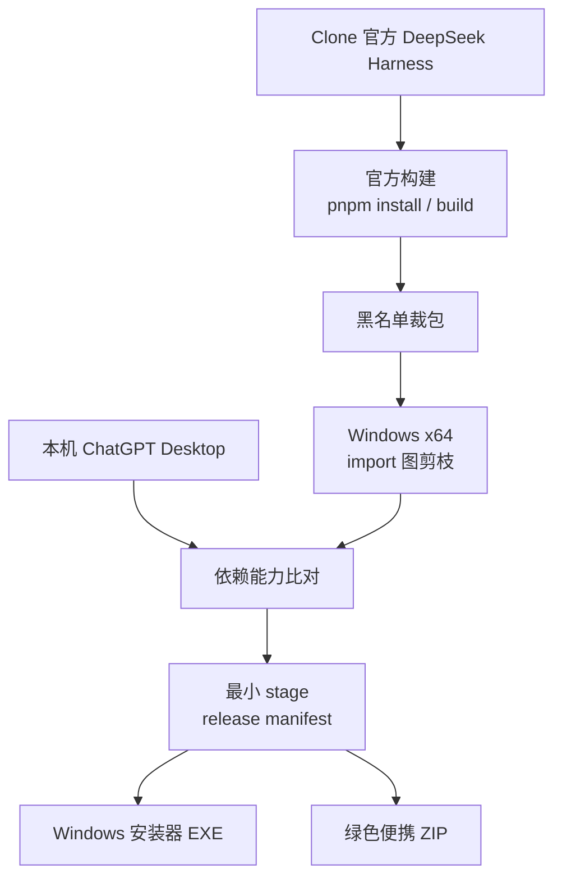

# DeepSeek Harness on ChatGPT

本仓库提供一套 **DeepSeek Harness 体积最小化（42.33 MiB）构建与打包脚本**；构建产物是安装阶段零联网下载依赖的 Windows x64 **增量安装包**与**绿色便携包**，将借用ChatGPT桌面版的运行环境。


*ChatGPT的折叠图标上竟然出现了...蓝色鲸鱼...?*

**DeepSeek Harness on ChatGPT 直接复用本机 ChatGPT Desktop 的 Node.js 与 Electron 运行环境，因此运行本项目提供的 EXE 前，电脑上必须已经安装 Microsoft Store 版 ChatGPT 桌面应用。** 

生成的安装包只携带 ChatGPT 中不存在、且 DeepSeek Harness 运行时确实需要的最小闭包；Node、Electron、Chromium、部分 npm 模块和原生组件通过 junction/symlink 直接复用现有 ChatGPT 安装。安装和首次启动阶段 **零联网下载依赖**，不会临时下载 Node、Electron 或 npm 包。安装器会先检查本机 ChatGPT 是否提供完整接口，检查通过才释放程序并建立链接；检查失败则直接退出。

## 为什么这么小

常规“零依赖”桌面包需要再次携带完整 Node、Electron/Chromium 和所有运行依赖。本项目把 ChatGPT Desktop 视为已经存在的共享运行时，只增量安装 DeepSeek Harness 自有文件。

基于本机 `OpenAI.Codex_26.818.3698.0_x64__2p2nqsd0c76g0` 与 DeepSeek Harness `0.1.1-rc.2` 的实测结果：

| 方案 | 下载文件 | 静态展开 | 首次启动后实际新增 | 说明 |
|---|---:|---:|---:|---|
| 本项目安装器 | **9.30 MiB** | 约 **42.33 MiB** | 约 **48.91 MiB** | 首次启动额外复制 6.58 MiB stub/DLL；链接目标不重复占用磁盘 |
| 本项目绿色便携 ZIP | **16.00 MiB** | **42.33 MiB** | 约 **48.91 MiB** | 与安装版使用同一静态 payload，不注册系统安装项 |
| 等价“零依赖”自包含包 | 取决于压缩值 | 约 **684.7 MiB** | 约 **684.7 MiB** | 必须额外打入当前实际复用的 642.4 MiB Node/Electron/npm 闭包 |

相同功能闭包下，本项目首次启动后的新增占用约为自包含方案的 **1/14**，避免重复存放约 **642.4 MiB** 已由 ChatGPT 提供的文件。Chromium profile、会话和缓存属于运行数据，不计入任何一行。

实际复用内容包括：

- ChatGPT 的 `node.exe`，以 `OpenAI.Codex` 包身份启动。
- Electron/Chromium host 文件，包括 `chrome.dll`、locales、GPU/runtime DLL 等。
- 27 个 manifest npm junction，包括 Playwright、Sharp、Canvas、PDF.js、Tesseract 等。
- ChatGPT 自带的 `rg.exe` 与 `node-pty` Windows native build。
- 启动时只复制必须改名或无法直接链接的 `ChatGPT.exe -> owl-stub.exe` 和 `chrome_elf.dll`。

完整复用清单见 [ChatGPT 依赖清单](docs/CHATGPT-DEPENDENCY-INVENTORY.md)。

## 安装与运行

从 GitHub Release 下载并运行：

```text
DeepSeek-Harness-on-ChatGPT-Setup-<version>-win-x64.exe
```

安装后的应用、开始菜单和桌面快捷方式名称为 `DeepSeek Harness (on ChatGPT)`。安装器自动流程如下：

1. 自动探测当前用户安装的最高版本 `OpenAI.Codex*`。
2. 验证 Node、Electron、所有 npm junction 和 native asset fork 是否齐全。
3. 释放约 42.33 MiB 的 DeepSeek Harness 增量 payload。
4. 安装器启动时请求 UAC；安装过程由 C# controller 创建 manifest 声明的 junction/symlink，并同步必要 stub/DLL，不执行运行时 PS1。
5. 注册标准 Windows 应用、开始菜单、桌面快捷方式和卸载器。

每次启动都会重新验证 ChatGPT 路径和能力。ChatGPT 更新后，启动器会自动修复失效链接和重新同步复制文件；不会终止、替换或修改已经运行的 `ChatGPT.exe`。

## 运行环境嵌入



Electron 页面右侧提供可折叠、可调整宽度且支持多标签页的内置终端。终端已预先配置当前 DSH release 所需的命令与环境，可以直接执行：

```text
dsh --version
node --version
pnpm --version
```

- `dsh` 执行当前安装包携带的 CLI，并使用该程序自己的 `.dshhome`。
- `node` 来自本机 Microsoft Store 版 ChatGPT，并通过其包身份运行。
- `pnpm` 由安装包内约 0.85 MiB 的 Corepack 下载器固定解析为 `pnpm@11.7.0`。首次执行 `pnpm` 时需要联网下载，完成后复用 `.dshhome\corepack` 中的缓存。

内置终端支持手动管理插件，例如安装插件市场：

```text
dsh plugin --profile web add @sanqi-normal/dsh-webui-market-plugin
```

DSH 内 agent 启动的命令进程也会继承同一套 `dsh`、ChatGPT Node 和按需下载的 pnpm 环境，因此 agent 可以自行执行上述插件安装命令。

这些环境变量和命令路由仅对 Electron 壳提供的内置终端及 DSH 内 agent 启动的命令进程有效。程序不会修改系统或用户 `PATH`，也不会把随包的 `dsh`、ChatGPT Node 或 pnpm 暴露给应用外部新开的 CMD、PowerShell 或其他终端。

### Windows 极简模式的持久 shell

官方 DSH `0.1.1-rc.2` 起，极简 preset 在 Windows 上不再使用 Bash：`terminal-bash`/`persistent-bash` 在 win32 禁用，官方新增的 `terminal-pwsh`/`persistent-pwsh`（`@deepseek-ai/dsh-tool-pwsh-persistent` + `@deepseek-ai/dsh-terminal-bash`，`shellDialect: pwsh`）在 win32 启用。本项目已移除早期的 packager-owned pipe-bash overlay，直接发布官方 preset，由官方 PTY 链路驱动。

官方 pwsh 解析按顺序查找 PowerShell 7、PATH 上的 `pwsh.exe`，最后回退 Windows 自带 PowerShell 5.1（`System32\WindowsPowerShell\v1.0\powershell.exe`），因此**不要求本机预装 pwsh 7**。PTY 由 `node-pty` 提供，但两类宿主使用各自匹配的 native ABI：DSH 后端的 ChatGPT CUA Node 使用随包保留的 `prebuilds\win32-x64\conpty.node` 与 `conpty_console_list.node`（合计约 0.41 MiB）；Electron 内置终端则由 controller 按 manifest 将 `node_modules\node-pty\build` junction 到当前 ChatGPT 的 `app.asar.unpacked\...\node-pty\build`，并使用 Windows 系统 ConPTY，不复制私有 `conpty.dll`。Windows 进程表 inspection 由随包的 `koffi`/`@koromix/koffi-win32-x64` 承担，均不需要联网下载。

绿色版解压后直接运行 `DeepSeek Harness (on ChatGPT).exe`。启动器 EXE 会以自身名义请求 UAC，再由内置 C# controller 执行相同的依赖验证和链接修复逻辑。

## 最小构建思路



1. `build.ps1` 将官方 [`deepseek-ai/deepseek-harness`](https://github.com/deepseek-ai/deepseek-harness) clone 到 `.work\deepseek-harness`，可固定 tag、branch 或 commit；该 clone 不进入本仓库。
2. 不修改上游已跟踪源码、`package.json` 或 lockfile，先执行完整官方构建，再从编译产物和生产依赖中收集运行闭包。
3. 应用功能黑名单和 Windows x64 平台规则，再按 npm import 图与 workspace 文件图删除不可达内容、测试、文档、source map、声明文件和其他架构 native 文件。
4. 将闭包与本机 ChatGPT Desktop 比对：可复用内容写入 junction/symlink manifest，只把 ChatGPT 没有的依赖装入私有 `node_modules`。
5. 运行多 provider/Web import、实际 ConPTY 启动 smoke 和 ChatGPT preflight；全部通过后生成静态 stage、安装器与绿色 ZIP。安装包本身不再需要联网补依赖。

## 裁包列表

对 `node_modules` 的第一步裁剪采用黑名单机制，具体分为两类：一类是体积明显偏大、桌面场景利用率较低的可选功能；另一类是目标发布版明确不需要携带的能力与构建残留。

### 1. 体积过大、利用率低的可选功能

删除 **其他模型子代理与 Hooks**：Claude Code/Codex 子代理、对应 hooks，以及 `@anthropic-ai/claude-agent-sdk` 平台包。这是本打包方案在桌面功能上唯一主动牺牲的能力，即 DeepSeek Harness 不能再从内部直接调用 Codex 或 Claude Code（CC）作为子代理；除此之外，核心功能与官方版本一致。ACP、ACP 子代理和 pi-ai 多模型后端均保留，添加或切换不同供应商的模型不受影响。

### 2. 发布版明确不需要的能力

| 内容 | 裁剪范围 |
|---|---|
| E2B 云沙箱 | E2B sandbox、filesystem、subprocess workspace 包及 `e2b` npm 包 |
| OpenTelemetry 遥测 | `dsh-session-telemetry-otel` 与 `@opentelemetry/*` SDK/exporter |
| 构建期 Typert | 仅删除 `dsh-typert-generator`；运行时 protocol/registry/loader 保留 |
| Demo 与测试支持 | ACP/demo、JSON-RPC demo、loader smoke、LLM mock/replay、agent loop testkit 等 |
| Build Tooling | esbuild、Rolldown、Rollup、Vite、TSX、Lightning CSS 及其构建期依赖 |
| DOM 与测试栈 | JSDOM、Vitest、Testing Library、Chai、DOM/CSS parser 及测试辅助依赖 |

完整、机器可读的包名与路径规则以 [config/release-blacklist.json](config/release-blacklist.json) 为准。

## 已验证版本

| 组件 | 本机验证值 |
|---|---|
| Windows | Windows x64 |
| DeepSeek Harness ref | `dsh-v0.1.1-rc.2` |
| ChatGPT Desktop version | `26.818.3698.0` |
| pnpm | `11.7.0` |
| Build Node | `24.19.0`（PATH 内 ChatGPT cua_node；满足上游 `^22.19.0 || >=24.0.0`） |

ChatGPT 版本号只是验证记录，不是硬编码约束。兼容性由实际路径和 API 能力决定。

## 构建

要求 Windows x64、PowerShell 5.1、Git、Node.js 22+、pnpm 11.7.0，以及当前用户已安装 Microsoft Store ChatGPT Desktop。Inno Setup 6 缺失时通过 `winget` 自动安装。

```powershell
# 默认构建 dsh-v0.1.1-rc.2
powershell -NoProfile -ExecutionPolicy Bypass -File .\build.ps1

# 构建其他官方 ref
powershell -NoProfile -ExecutionPolicy Bypass -File .\build.ps1 -Ref <ref>

# 使用自行准备的官方 clone
powershell -NoProfile -ExecutionPolicy Bypass -File .\build.ps1 `
  -Source D:\src\deepseek-harness
```

首次默认构建会 clone 官方源码到 `.work\deepseek-harness`。`-Offline` 禁止 fetch，`-StageOnly` 只生成最小 stage，`-SkipOfficialBuild` 复用已有 `dist\stage` 重新打包。

```text
dist/
  stage/       最小运行闭包与 release-manifest.json
  installer/   DeepSeek-Harness-on-ChatGPT-Setup-<version>-win-x64.exe
  portable/    DeepSeek-Harness-on-ChatGPT-Portable-<version>-win-x64.zip
```

## 仓库结构

```text
build.ps1                    clone -> official build -> prune -> package
config/release-blacklist.json
scripts/                     构建、闭包分析和安装器生成
scripts/lib/                 npm/workspace 图剪枝器
src/runtime/                 任务栏图标辅助程序
src/shell/                   最小 Electron shell 覆盖层
src/installer/               C# controller、启动器与 Inno Setup 定义
assets/branding/             图标资产
docs/                        依赖与发布设计
.work/                       本机构建缓存，不进入 Git
dist/                        所有生成物，不进入 Git
```

闭包算法见 [Windows x64 最小闭包](docs/RELEASE-MINIMAL.md)，安装与卸载行为见 [Windows 发布说明](docs/INSTALLER.md)。

## 发布注意

- 安装器和启动器当前未签名，公开下载可能触发 SmartScreen。
- 本仓库只提供打包逻辑。DeepSeek Harness、ChatGPT Desktop 及其依赖仍受各自许可证和服务条款约束。
